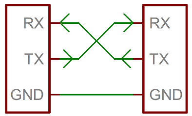
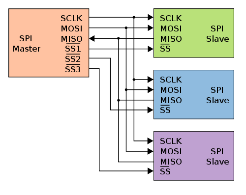
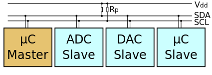
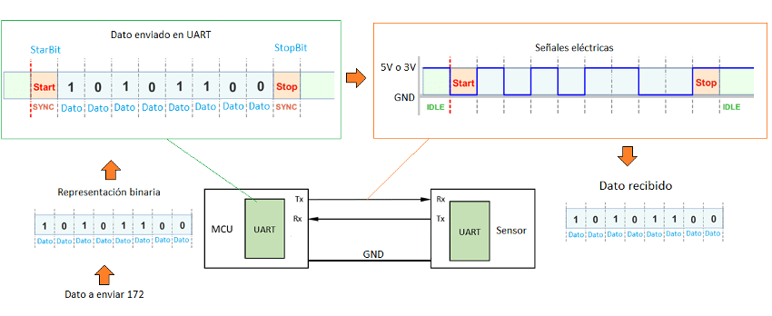
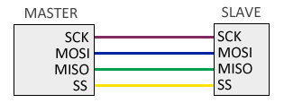
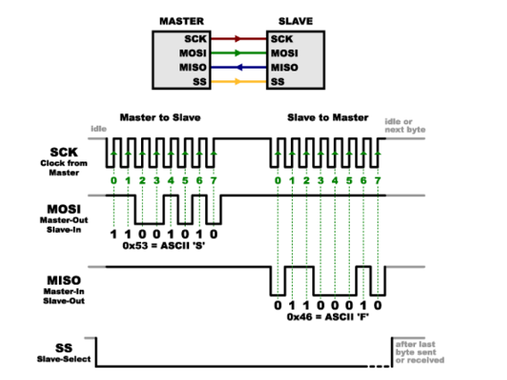
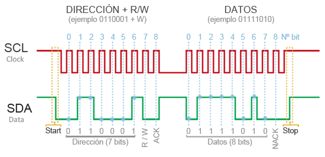

# Protocolos de Comunicación Serie

??? note "Recursos usados"

    - Este video explica maravillosamente lo que aquí se expone
        <iframe
            width="560"
            height="315"
            src="https://www.youtube.com/embed/G7aQB6x0LHc"
            title="YouTube video player"
            frameborder="0"
            allow="accelerometer; autoplay; clipboard-write; encrypted-media; gyroscope; picture-in-picture"
            allowfullscreen
        ></iframe>
    - [En esta página](https://www.drouiz.com/blog/2018/06/25/uart-vs-spi-vs-i2c-diferencias-entre-protocolos/) hay una tabla maravillosa
    - [En esta página](https://solectroshop.com/es/blog/diferencias-de-los-protocolos-de-comunicacion-uart-vs-i2c-vs-spi-n107) explican los protocolos en profundidad.
    - Luis Llamas es una fuente de conocimiento enorme para cualquier maker
        - [Arduino Puerto Serie](https://www.luisllamas.es/arduino-puerto-serie/)
        - [Arduino SPI](https://www.luisllamas.es/arduino-spi/)
        - [Arduino I2C](https://www.luisllamas.es/arduino-i2c/)
    - Distancias del cable para Serial
        - [RS232](https://www.lammertbies.nl/comm/info/rs-232-specs)
        - [Velocidad distancia](https://forum.huawei.com/enterprise/es/velocidad-de-transimisi%C3%B3n-serial-generalmente-a-9600-y-no-115200-%C2%BFpor-qu%C3%A9/thread/506863-100251)

???+ danger "No decir nunca más "Maestro-Esclavo""

    Aunque antiguamente se ha usado el término **Maestro** y **Esclavo**, esto tiene connotaciones muy negativas.

    A partir de ahora se recomienda usar **Controlador** y **Periférico**.

    Las palabras son herramientas, y las herramientas modelan nuestra forma de ver las cosas. No uses herramientas ofensivas.

    Si en algún momento ves estas palabras, se han dejado por legibilidad, para que entiendas el legacy que ya existe, o por error. Pero no porque se esté a a favor de esta terminologóa.

|     | UART | SPI | I2C |
| :-: |:---- | :-- | :-- |
| Nombre | Universal Asynchronous Receiver/Transmitter | Serial Peripheral Interface | Inter-Integrated Circuit |
| Diagrama |  | |  |
| Pines | - TX: Transmisión de datos. - RX: Recepción de datos. | - SCLK: Reloj Serial - MOSI: Salida de maestro, entrada de esclavo. - MISO: Entrada del maestro y salida del esclavo. - SS: Selector de esclavo. | - SDA: Datos - SCL: Reloj Serial |
| Sincronía | Asincrona | Sincrona | Sincrona |
| Tranmisión | Duplex | Duplex | Half-duplex |
| Topología | Uno-a-Uno | Bus | Bus |
| Numero de Masters | No hay | Uno | Varios |
| Velocidad máxima | 230Kbbs ~ 460kbb | 10Mbbs ~ 20Mbbs | Hasta 3.4Mbbs Algunas variantes hasta 1Mbbs |
| Distancia | Menos de 15 metros | Comunicaciones dentro de la PCB Menos de 30cm | Comunicaciones dentro de la PCB Menos de 1 metro |
| Consumo energético | Medio | Bajo | Medio |
| Complejidad HW | Poco | Media | Bastante (según los maestros) |
| Direccionamiento SW | No | Señal SS (SS1, SS2…) para seleccionar que dispositivo, cuantos más dispositivos más salidas SS necesitamos. | Todos los maestros pueden comunicarse con todos los esclavos, podemos colocar 27 esclavos y colocar la dirección en el protocolo I2C. |
| Ventajas | Muy simple Permite conectar de forma rápida dos dispositivos Suele usarse con RS232 o RS485 por ejemplo. | Simple. Dispone de comunicación full duplex SPI usa push-pull y gran velocidad de datos. Requiere menos energía que I2C | Más de un maestro. Solo necesita dos cables para la comunicación. Es más sencillo que SPI, al necesitar menos líneas. Concepto de colector abierto Tiene control de flujo. |
| Desventajas | Esta limitado a la comunicación entre dos dispositivos. La velocidad se debe acordar al principio de la conexión en caso de no ser la misma dará lecturas erróneas. | Cuanto más esclavos, más conexiones se necesitan. Añadir un dispositivo requiere una conexión adicional. No hay control de flujo. | Se incrementa la complejidad del circuito cuando aumentan los masteres y los esclavos. I2C es half duplex El software puede sobrecargar el procesador. |
| Inicio |  | Motorola en 1980 | Philips en 1982 |

## UART (Universal Asynchronous Receiver/Transmitter) / Serial

El Transmisor / Receptor Universal Asíncrono es la comunicación serie ASÍNCRONA más sencilla que existe.
Es comunicación 1 a 1.
Solo necesita dos conexiones:

1. GND - Referencia a tierra
2. TX / RX - Por donde se mandan / reciben datos.

En realidad es una comunicación simplex (de un solo sentido). Pero normalmente una UART viene preparada con una señal TX y otra RX, así que se consigue una comunicación duplex (1 simplex para escribir y 1 simplex para leer).

Como el TX emite datos cuando quiere, no hay reloj, hace falta que TX y RX compartan una configuración. Esta se compone de:

1. Velocidad de la transmisión en baudios.
2. Longitud de las tramas en bits.
3. Bits de Start y Stop.

La nomenclatura típica para definir esta configuración es `<velocidad>/<longitud><paridad><bits stop>`.
A veces la velocidad se indica por separado, y la nomenclatura solo se pone como `<longitud><paridad><bits stop>`.
La más típica es `9600/8N1` o `8N1` a `9600`:

- `9600` baudios
- `8` bits de datos / trama
- `N` no hay paridad (no se mide si los bits a 1 son pares o impares)
- `1` bit de stop

¿Como funciona? Supongamos una comunicación 8N1 a 9600 baudios (104 microseg por bit):

1. El TX y RX tienen la misma configuración.
2. El TX está en reposo mandando 1 todo el rato.
3. Cuando TX empieza a transmitir, manda el bit de Start, que es un 0.
4. Después de manda los 8 bits de datos.
5. El RX lee cada bit a partir de la mitad para evitar estados transitorios.
    -  Después del bit de start, espera 52 microseg para leer el primer bit.
    -  Después lee cada bit a 104 microseg.
6. El TX después de mandar los 8 bits de datos, manda el bit de Stop, que será a 0, y luego ya pone la línea a 1 todo el rato.
7. El RX después de leer el bit de Stop, empieza a leer 1 todo el rato y se queda a la espera de que vuelva a recibir un bit de Start.

<figure markdown>
  
  <figcaption>Ejemplo trama en 8N1</figcaption>
</figure>

=== "Velocidad de Transmisión"

    Se mide en baudios, e indica la cantidad de bits que se mandan por segundo.

    Ej: Una velocidad de 9600 baud/seg equivale a que cada bit se manda a 1/9600 = 0,000104167 seg = 104,167 microseg.

    A mayor velocidad, menor distancia efectiva se tiene:

    | Velocidad (baudios) | Tiempo por bit (microseg) | Distancia típica (m)| Distancia máxima (m) | Distancia maxima en RS232 (m) |
    | :-----------------: | :-----------------------: | :--------------: | :--------------: | :-----------------------: |
    | **115200** | 8,681 | 2~3 | 5 | 15,24 |
    | 57600 | 17,361 |  |  |  |
    | 38400 | 26,042 |  |  |  |
    | 31250 | 32,000 |  |  |  |
    | 28800 | 34,722 |  |  |  |
    | 19200 | 52,083 |  |  |  |
    | 14400 | 69,444 |  |  |  |
    | **9600** | 104,166 | 10 | <20 | 152,4 |
    | 4800 | 208,333 |  |  | 304,8 |
    | 2400 | 426,666 |  |  | 914,4 |
    | 1200 | 833,333 |  |  |  |
    | 600 | 1666,666 |  |  |  |
    | 300 | 3333,333 |  |  |  |

=== "Configuraciones más usadas"

    | Configuración | Longitud | Paridad | Bits de Stop |
    | :-: | :-: | :-: | :-: |
    | 5N1 | 5 | No | 1 |
    | 6N1 | 6 | No | 1 |
    | 7N1 | 7 | No | 1 |
    | **8N1** | 8 | No | 1 |
    | 5N2 | 5 | No | 2 |
    | 6N2 | 6 | No | 2 |
    | 7N2 | 7 | No | 2 |
    | 8N2 | 8 | No | 2 |
    | 5E1 | 5 | Even | 1 |
    | 6E1 | 6 | Even | 1 |
    | 7E1 | 7 | Even | 1 |
    | 8E1 | 8 | Even | 1 |
    | 5E2 | 5 | Even | 2 |
    | 6E2 | 6 | Even | 2 |
    | 7E2 | 7 | Even | 2 |
    | 8E2 | 8 | Even | 2 |
    | 5O1 | 5 | Odd | 1 |
    | 6O1 | 6 | Odd | 1 |
    | 7O1 | 7 | Odd | 1 |
    | 8O1 | 8 | Odd | 1 |
    | 5O2 | 5 | Odd | 2 |
    | 6O2 | 6 | Odd | 2 |
    | 7O2 | 7 | Odd | 2 |
    | 8O2 | 8 | Odd | 2 |

=== "Longitud de las tramas"

    La longitud de las tramas indica la cantidad de bits que son información.
    
    No se tienen en cuenta los bits de Start y Stop.

    Longitudes típicas son: 8, 7, 6 y 5 bits.

=== "Bits de Start / Stop"

    La línea es activa a nivel bajo, es decir, el TX siempre está a 1 cuando no manda información
    porque así es más inmune al ruido, aunque consuma más.

    Para el Start se utiliza 1 solo bit. Luego la comunicación empieza cuando se recibe un 0, y a partir de ahí se cuentan X bits.

    El último o últimos bits de la trama son el de Stop. Sirven como control de errores, indicando la paridad o no.
    Si se indica la paridad, esto quiere decir la cantidad de bits de datos que están a 1 son pares (Even) o impares (Odd).
    Esto sirve a modo de control de error, pero no indica donde está el error. Y como se envía con cada trama, es demasiado redundante.
    Es preferible implementar un sistema de CRC a enviar los bits de paridad.

## SPI (Serial Peripherial Interface)

La Interfaz Serie Periférica, es un protocolo de comunicación serie SÍNCRONO.
Es para comunicar una unidad con varios periféricos dentro de una placa.
Esta unidad sería el Controlador, y las demás los Periféricos. Es decir, comunicación 1 a N.
Necesita de las siguentes conexiones:

1. GND - Referencia a tierra
2. SCLK (Serial Clock) - Señal de reloj mandada por el Controlador
3. MOSI (Master Output Slave Input) / COPI (Controller Output Peripheral Input) - El TX del Controlador y RX del Periférico
4. MISO (Master Input Slave Output) / CIPO (Controller Input Peripheral Output) - El RX del Controlador y TX del Periférico
5. SSx (Slave Select) / CSx (Chip Select) - Señal que habilita la comunicación con el Periférico

<figure markdown>
  
  <figcaption>Conexión SPI con solo un Periférico</figcaption>
</figure>

En realidad es una comunicación simplex (de un solo sentido). Pero normalmente tanto el Controlador como los Periféricos para emitir y otra para recibir, así que se consigue una comunicación duplex (1 simplex para escribir y 1 simplex para leer).

Antes de cada comunicación, el Controlador-Periférico saben cuantos datos / bytes / bits se van a mandar / recibir.

¿Como funciona?

1. El Controlador decide iniciar la comunicación con un Periférico poniendo su señal CS a 0 y haciendo que funcione la señal SCLK.
2. El Controlador manda datos por su COPI y el Periférico los lee por su COPI.
3. El Controlador recibe datos por su CISO y el Periférico los manda por su CIPO.
4. El Controlador vuelve a poner la señal CS a 1.

<figure markdown>
  
  <figcaption>Muestra de comunicación SPI</figcaption>
</figure>

## I2C (Inter-Integrated Circuit)

El Circuito Inter-Integrado es un protocolo de comunicación serie SÍNCRONO.
Es para comunicar una unidad con varios periféricos dentro de una placa.
Esta unidad sería el Controlador, y las demás los Periféricos. Es decir, comunicación 1 a N.
Necesita de las siguentes conexiones:

1. GND - Referencia a tierra
2. SCLK (Serial Clock) - Señal de reloj mandada por el Controlador
3. SDA (Serial Data) - Por donde transitan los datos del Controlador y los Periféricos

<figure markdown>
  
  <figcaption>Ejemplo conexión I2C en bus</figcaption>
</figure>

Es una comunicación half-duplex. Solo un controlador o periférico puede enviar datos por SDA.

Antes de cada comunicación, el Controlador-Periférico saben cuantos datos / bytes / bits se van a mandar / recibir.

¿Como funciona?

1. Como se comparte SDA, cada Periférico tiene una dirección.
2. Un Controlador decide iniciar la comunicación con un Periférico.
3. Inicia la señal de SCLK y manda por SDA:
    1. La dirección de memoria del Periférico.
    2. Si quiere transmitir o leer datos.
    3. Si quiere transmitir, manda los datos.
    4. Si quiere recibir, espera que el Periférico le mande la información.
4. El único Periférico que tenga esa dirección es el que ejecutará la acción, y los demás no harán nada.
5. Por último el Controlador vuelve a dejar el bus intacto a nivel alto (gracias a las resistencias de pull-up del bus).

<figure markdown>
  
  <figcaption>Muestra de comunicación I2C</figcaption>
</figure>

## Otros

Existen numerosos tipos de comunicaciones serie:

- USART (como UART pero soportando sincronía)
- One Wire (un solo cable)
- Modbus
- CAN bus
- I2S (I2C para sonido)
- ...
